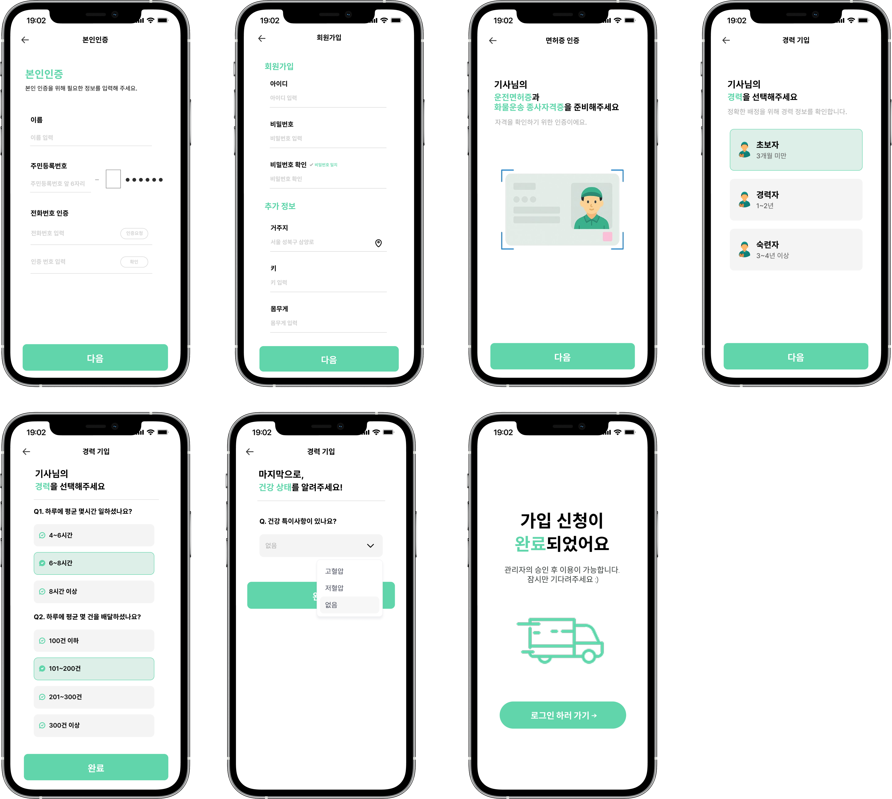
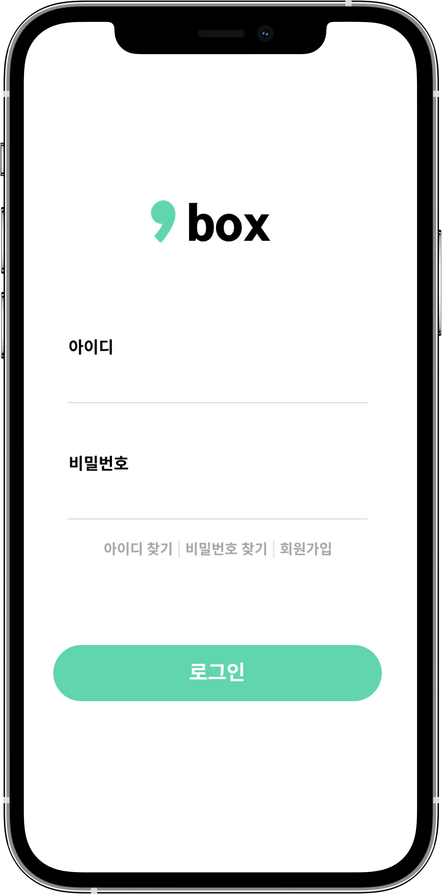
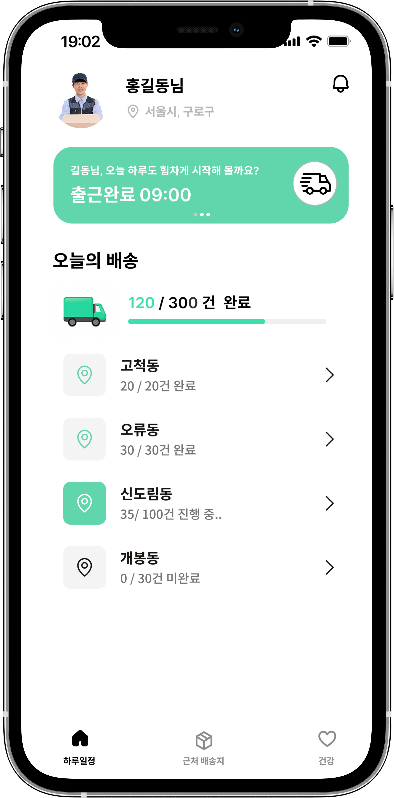
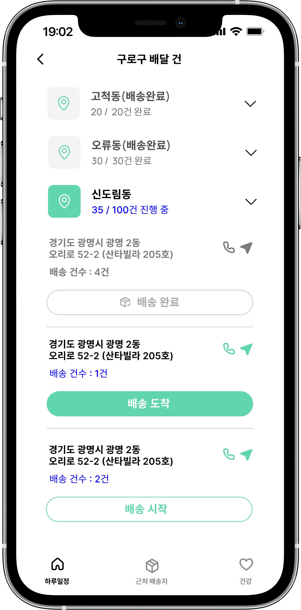
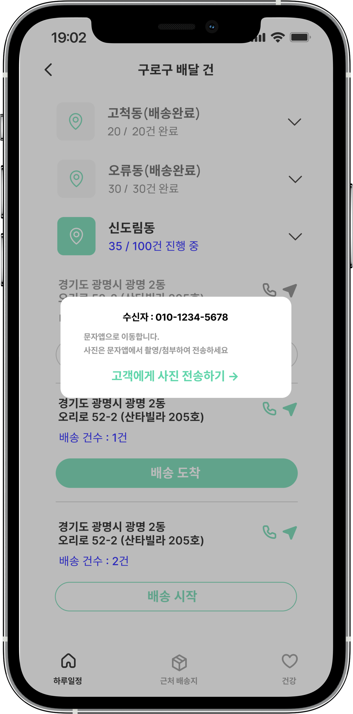
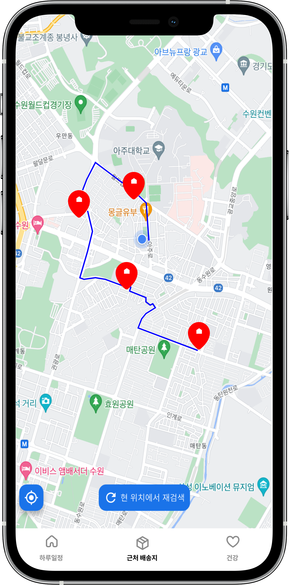
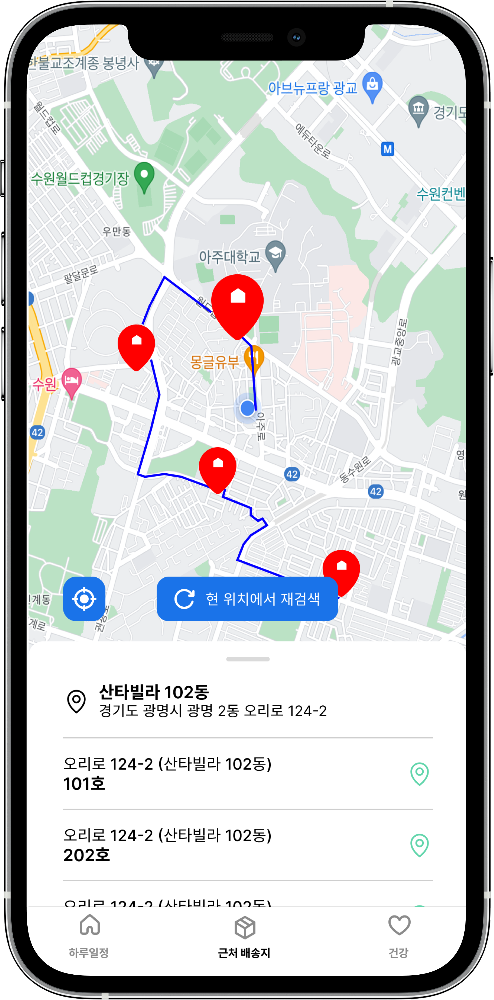
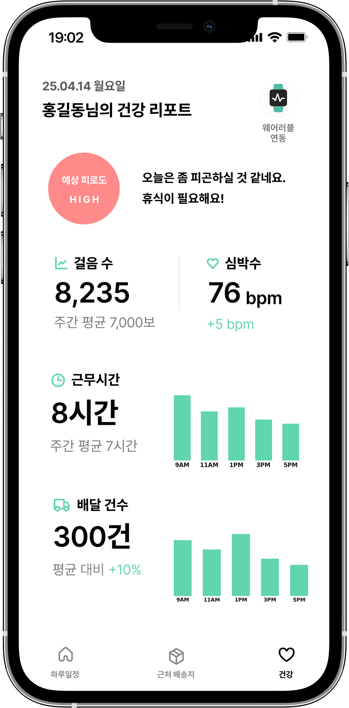
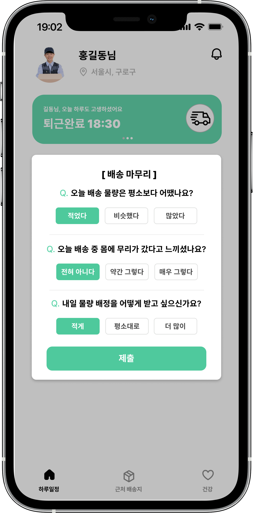

# 📦 SHIM BOX – 스마트 물류 앱 (Flutter)


**쉼박스(SHIM BOX)** 는 택배기사의 건강 데이터와 근무 패턴을 기반으로  
**개인 맞춤형 물량 배정**을 지원하는 스마트 물류 앱입니다.

본 저장소는 **Flutter 기반 기사용 앱(Frontend)** 을 다룹니다.

---

## 📌 프로젝트 소개

- 택배기사의 **근무시간 · 심박수 · 걸음수 · 배달건수 · 설문 데이터**를 수집하여  
  건강 상태와 피로도를 분석하는 앱입니다.
- 금일 배정 물량 확인, 배송 상세·길찾기, 고객 문자 전송 등  
  **실제 배송 업무 흐름을 앱에서 직접 처리**합니다.
- 출근·퇴근 기반 근무 시간 기록과 퇴근 설문을 통해  
  **다음날 물량 자동 배정 시스템**에 활용되는 핵심 데이터를 제공합니다.
- 삼성 헬스와 연동하여 실시간 걸음수·심박수를 수집하는 것이 큰 특징입니다.

---

## 🛠 사용 기술

- **Framework**: Flutter, Dart  
- **Device & Sensor**: Galaxy Watch, Samsung Health  
- **Networking**: HTTP 기반 REST API 통신  
- **지도/외부 연동**: Naver Map, URL Launcher  
- **상태 관리**: (예: Provider / Riverpod 등 실제 사용한 것으로 수정)  
- **기타**: Flutter Local Notifications 등

---

## 📱 주요 기능

### 1️⃣ 회원가입 & 로그인

신규 기사용 계정을 생성하고, 관리자 승인 이후 앱을 사용할 수 있습니다.

- 이메일 회원가입
- 기본 정보 및 건강 정보 입력
- 전화번호 인증
- 관리자 승인 후 로그인 가능

**예시 화면**




---

### 2️⃣ 메인 화면 – 출근 / 퇴근

출근 시 금일 배정 물량과 배송지 목록을 확인할 수 있고,  
퇴근 시에는 설문과 함께 근무를 마무리합니다.

- 출근 등록 및 근무 시작
- 금일 배정 물량 표시
- 오늘 배송해야 할 주소 리스트 확인
- 퇴근 등록 및 근무 종료

**예시 화면**

  


---

### 3️⃣ 배송 목록 & 상세

지역별 배송 목록을 확인하고, 각 배송지에 대해 상세 정보를 볼 수 있습니다.

- 지역/코스별 배송지 리스트
- 고객 전화 연결
- 문자 전송 버튼
- 배송 완료 처리

**예시 화면**

  


---

### 4️⃣ 최적 경로 안내 (TSP 기반)

여러 배송지를 가장 짧은 경로로 방문할 수 있도록  
TSP 휴리스틱 기반의 **최적 동선**을 제공합니다.

- 지도에 배송지 마커 표시
- 최적 방문 순서 안내
- 최대 9개 주소까지 경로 계산

**예시 화면**



---

### 5️⃣ 건강 리포트

삼성 헬스 연동으로 수집한 데이터를 기반으로  
기사의 건강 상태와 피로도를 시각화합니다.

- 실시간/일별 걸음수
- 평균·최고 심박수
- 근무 시간 및 배달 건수
- AI 기반 피로도 등급(좋음/주의/위험) 표시

**예시 화면**



---

### 6️⃣ 퇴근 설문 & 피로도 반영

하루 업무가 끝난 후, 간단한 설문을 통해 주관적인 피로도를 입력하면  
다음날 물량 배정에 반영됩니다.

- 오늘 업무 난이도 선택
- 무리감·통증 여부 체크
- 휴식 필요 여부 등

**예시 화면**



---

## 📂 앱 플로우 요약

1. 회원가입 및 관리자 승인  
2. 출근 → 금일 배정 물량 확인  
3. 배송 진행  
   - 배송지 목록 확인  
   - 상세 정보 / 길찾기 / 문자 전송  
4. 최적 경로 안내를 통해 효율적인 배송  
5. 퇴근 및 설문 제출  
6. 건강·근무 데이터가 AI 물량 배정에 활용

---

## 🧩 디렉토리 구조 (예시)

```bash
lib/
 ├── screens/       # 각 화면 (로그인, 메인, 배송 목록, 건강 리포트 등)
 ├── widgets/       # 공통 UI 컴포넌트
 ├── services/      # API 통신, 삼성헬스 연동 등
 ├── models/        # 데이터 모델 정의
 ├── providers/     # 상태 관리
 └── utils/         # 공통 유틸 함수
